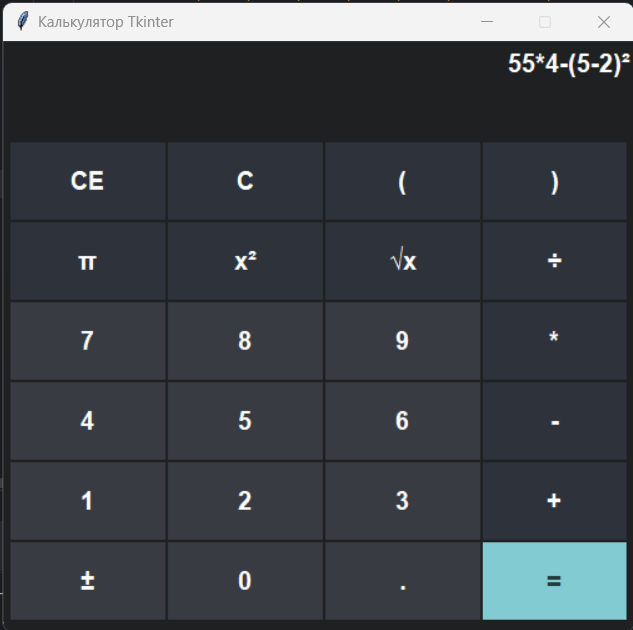

# calculator_tkinter
 intermediate certification work on creating a Python desktop application using the tkinter library
 
## Task
 Implement a desktop application in Python using calculator methods and the Tkinter library
 
## Screenshot of the application

   

## Installation

* Clone the repository using the command in the terminal
`git clone https://github.com/alexeyvershinin/calculator_tkinter.git` or download the archive from the link
